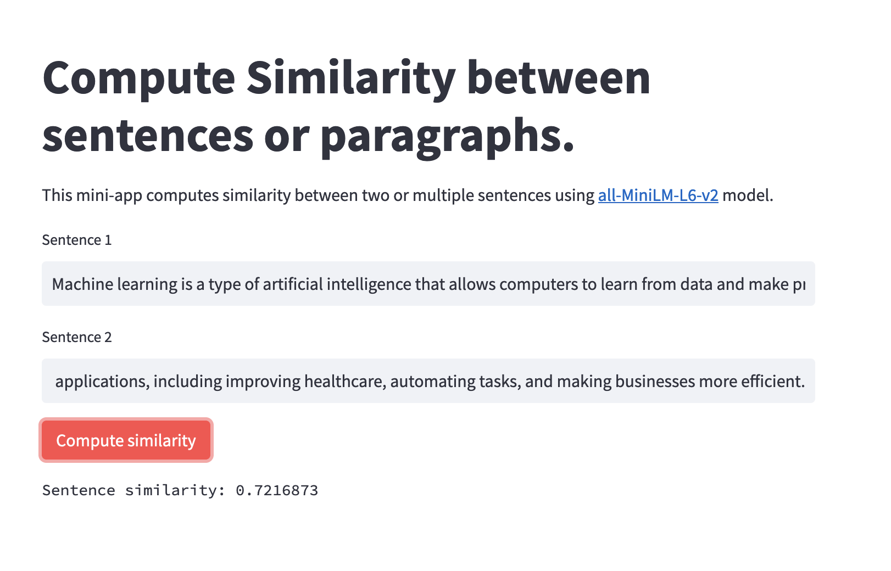

# Sentence Similarity streamlit app + Flask API
This repository contains the code for a **streamlit app and flask API to compute sentence or paragrpah similarity** using [all-MiniLM-L6-v2](https://huggingface.co/sentence-transformers/all-MiniLM-L6-v2) model.

Streamlit app:

#### How to run:
- Run flask API `app.py`: `python app.py`.
- Run Streamlit app `similarity.py`: `streamlit run similarity.py`.